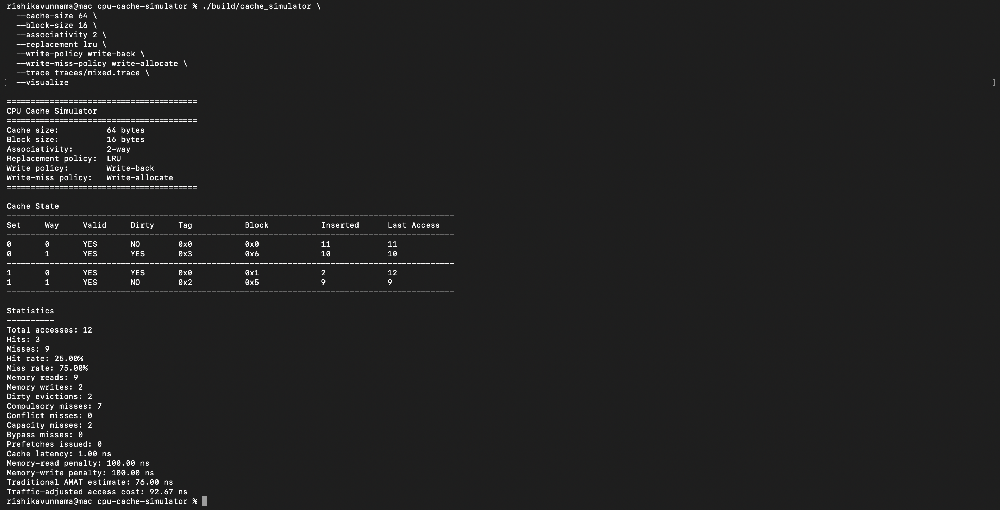
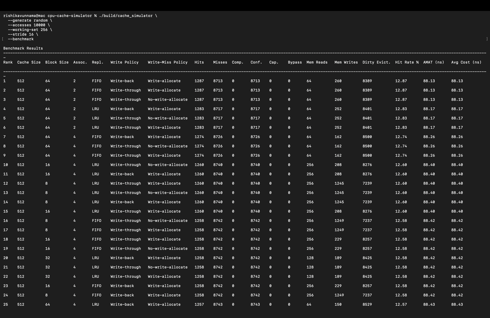
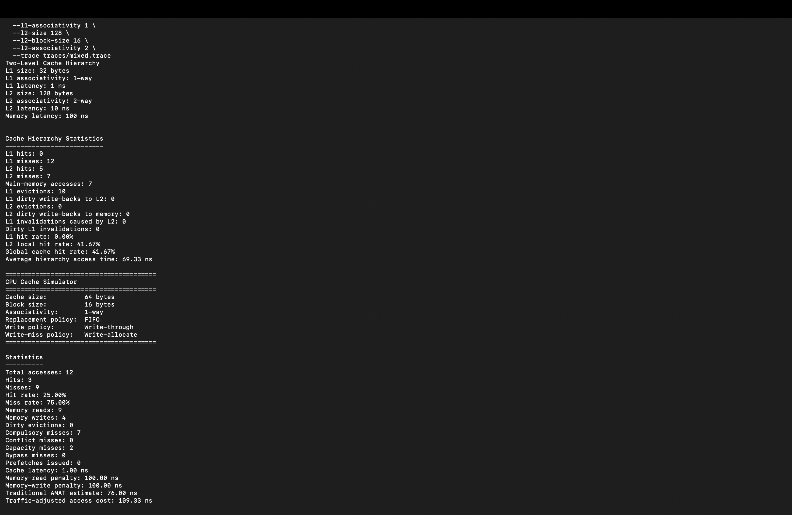
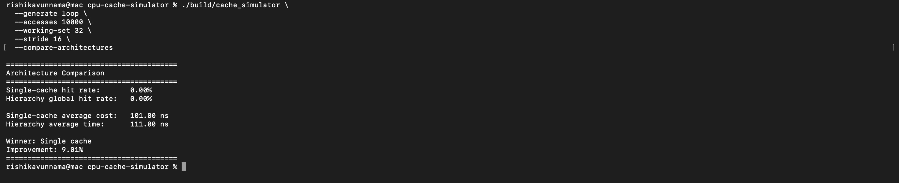
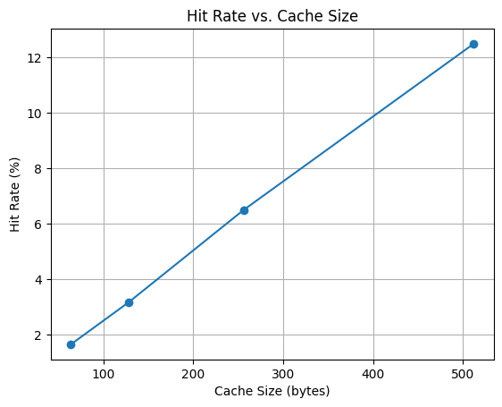
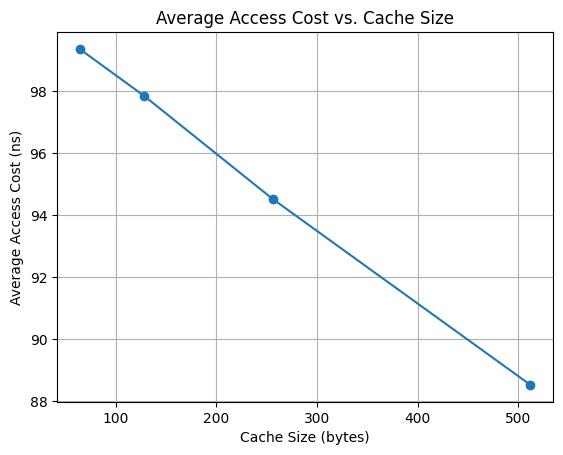
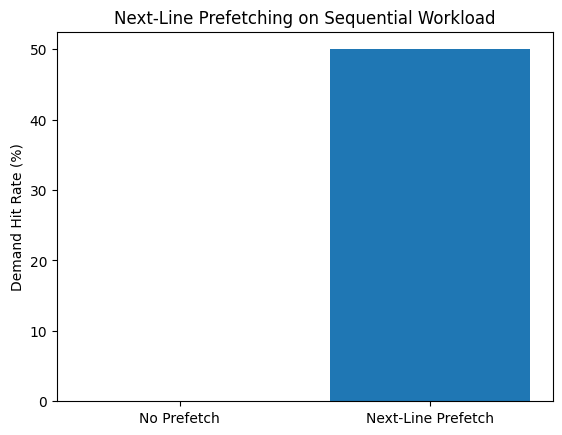
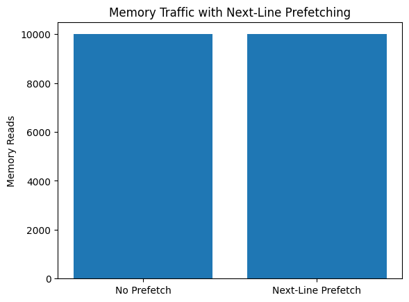

# CPU Cache Simulator

A configurable CPU cache simulation and analysis tool written in modern C++.

The simulator models direct-mapped and set-associative caches, multiple replacement and write policies, memory traffic, miss classifications, benchmarking, visualization, and performance estimates.

## Features

- Direct-mapped and N-way set-associative caches
- FIFO and LRU replacement policies
- Write-through and write-back behavior
- Write-allocate and no-write-allocate behavior
- Read/write memory traces
- Dirty-bit tracking and dirty evictions
- Compulsory, conflict, capacity, and bypass miss classification
- Memory-read and memory-write statistics
- Traditional AMAT estimation
- Traffic-adjusted average access cost
- Multi-configuration benchmark mode
- CSV export
- Cache-state visualization
- Step-by-step simulation
- Automated tests
- CMake build system

## Technology

- C++17
- CMake
- Standard Template Library
- Git and GitHub

## Project Structure

cpu-cache-simulator/
├── include/
├── src/
├── tests/
├── traces/
├── scripts/
├── results/
├── README.md
├── CMakeLists.txt
└── LICENSE

## Architecture

```text
main.cpp
│
├── TraceParser
├── WorkloadGenerator
├── BenchmarkRunner
├── HierarchyBenchmarkRunner
├── ArchitectureComparisonRunner
│
├── SetAssociativeCache
│   ├── CacheSet
│   │   └── CacheLine
│   ├── CacheStatistics
│   ├── MissClassifier
│   └── Replacement Policies
│
├── CacheHierarchy
│   └── HierarchyStatistics
│
└── CacheVisualizer
```
## Quick Start

### Prerequisites

- C++17 compatible compiler (GCC, Clang, or MSVC)
- CMake 3.16 or newer

### Clone the Repository

```bash
git clone https://github.com/rvunnama/cpu-cache-simulator.git
cd cpu-cache-simulator
```

### Build

```bash
mkdir build
cd build
cmake ..
cmake --build .
```

### Run

```bash
./cache_simulator \
  --cache-size 64 \
  --block-size 16 \
  --associativity 2 \
  --replacement lru \
  --write-policy write-through \
  --write-miss-policy write-allocate \
  --trace ../traces/basic.trace \
  --verbose
```

### View All Available Options

```bash
./cache_simulator --help
```

## Example Commands

### Cache Visualization

```bash
./cache_simulator \
  --visualize \
  --trace ../traces/basic.trace
```

### Benchmark Mode

```bash
./cache_simulator \
  --benchmark \
  --generate random \
  --accesses 10000
```

### Hierarchy Simulation

```bash
./cache_simulator \
  --hierarchy \
  --trace ../traces/mixed.trace
```

### Architecture Comparison

```bash
./cache_simulator \
  --compare-architectures \
  --generate loop \
  --accesses 10000
```

### Synthetic Workload

```bash
./cache_simulator \
  --generate sequential \
  --accesses 1000 \
  --stride 16
```

## Included Workloads

The repository contains targeted traces for testing specific cache behaviors:

| Trace | Purpose |
|---|---|
| `basic.trace` | Basic hit/miss behavior |
| `conflict.trace` | Conflict misses |
| `capacity.trace` | Capacity pressure |
| `replacement.trace` | FIFO vs. LRU |
| `locality.trace` | Temporal locality |
| `stride.trace` | Strided access behavior |
| `writeback.trace` | Dirty evictions |
| `mixed.trace` | Mixed read/write behavior |
| `stream.trace` | Streaming workload |

Synthetic workloads can also be generated with `--generate sequential`, `loop`, `stride`, or `random`.

## Example Output

Benchmark Results
------------------------------------------------------------

Rank Cache Assoc Repl Hit Rate AMAT

1    256   4-way LRU   97.3%    1.42 ns
2    128   4-way LRU   95.1%    2.17 ns
3     64   2-way FIFO  91.6%    4.91 ns

## Demo



Visualizes the final cache after simulation, showing each set, cache line, validity, dirty status, tag, block address, and replacement metadata.



Benchmarks cache configurations by cache size, block size, associativity, replacement policy, and write policy while ranked by average memory access cost (AMAT).



Simulates a two-level cache hierarchy, reporting L1 hits, L2 hits, memory accesses, and overall hierarchy performance.



Compares a single-cache design against a two-level L1/L2 hierarchy with the same workload and latency model by reporting hit rates, average access time, and the performance improvement of the better architecture.

## Performance Results

### Cache Size Scaling





### Next-Line Prefetching





Next-line prefetching improves sequential demand hit rate by proactively loading the following cache block. The benefit is workload-dependent and is much smaller for random-access patterns.

## Design Decisions

### Modular Architecture

This CPU Cache Simulator is organized into multiple, independent components. These each have a single responsibility, making it so Cache behavior, benchmarking, visualization, workload generation, hierarchy simulation, and statistics collection are all seperate classes. This allows for a project that is easier to maintain, test, and extend.

### Set-Based Cache Organization

Instead of storing cache lines in one large container, the simulator tries to model hardware by grouping cache lines into cache sets. This mirrors how actual set-associative caches organize memory and allows for simpler replacement policy implementation.

### Pluggable Replacement Policies

Replacement policies are implemented independently from the cache. The cache selects a victim line through a configurable policy interface, allowing FIFO and LRU to be exchanged to avoid interference with the cache implementation and to make additional policies straightforward to add.

### Flexible Write Policies

Write-through, write-back, write-allocate, and no-write-allocate behaviors are configurable through command-line options and not hardcoded. This permits different cache organizations to be tested using the same simulation framework.

### Integrated Benchmarking

In exchange of relying on external scripts, benchmarking is built directly into the simulator. This makes it so the simulator can evaluate multiple cache configurations automatically while recording performance metrics like hit rate, miss rate, AMAT, and memory traffic.

### Synthetic Workload Generation
Including the ability to read trace files, the simulator can generate sequential, looping, strided, and random workloads. This allows testing of the effect of different memory access patterns without manually creating trace files.

### Hierarchical Cache Simulation

L1 and L2 caches are modeled separately with their own dedicated hierarchy statistics. Separating hierarchy behavior from individual cache statistics keeps each component focused while allowing for multi-level performance analysis.

## Testing

### Unit Testing

The project includes automated tests covering:

- Cache initialization and validation
- Address decomposition (block address, set index, and tag)
- FIFO and LRU replacement behavior
- Write-through and write-back policies
- Write-allocate and no-write-allocate behavior
- Dirty evictions
- Miss classification
- Cache hierarchy behavior
- Synthetic workload generation
- Benchmark runner correctness

### Integration Testing

End-to-end testing verifies total simulator behavior using workloads. Through this testing, overall cohesiveness and correctness with statistics, benchmarking, hierarchy simulation, and workload generation integration is ensured.

### Manual Validation

The simulator was also validated using trace files that isolate specific cache behaviors, such as:

- Conflict misses
- Capacity misses
- Temporal locality
- Streaming access
- Mixed read/write workloads
- Dirty write-back scenarios

## Future Improvements

Although the simulator currently works well in supporting a wide range of configurable cache behaviors, more features can increase credibility and improve realism.

### Additional Prefetching Algorithms

Extend the simulator beyond next-line prefetching to include stride-based and adaptive prefetchers for comparison across different workloads.

### Victim Cache Support

Implement a small victim cache between L1 and L2 to reduce conflict misses and evaluate its impact on overall cache performance.

### Additional Replacement Policies

Add replacement algorithms such as Random, LFU, and pseudo-LRU to compare alternative cache management strategies.

### Multi-Level Hierarchies

Extend the hierarchy beyond L1 and L2 to support configurable L3 caches and more complex memory systems.

### Benchmark Visualization

Automatically generate charts from benchmark results to visualize relationships between cache parameters, hit rate, AMAT, and memory traffic.

### Larger Real-World Workloads

Evaluate the simulator using traces collected from real applications and standard benchmark suites in addition to synthetic workloads.